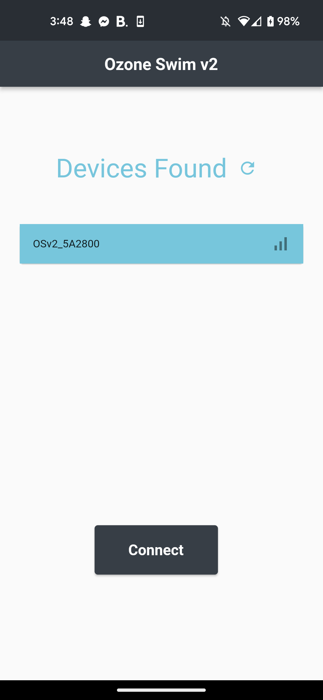
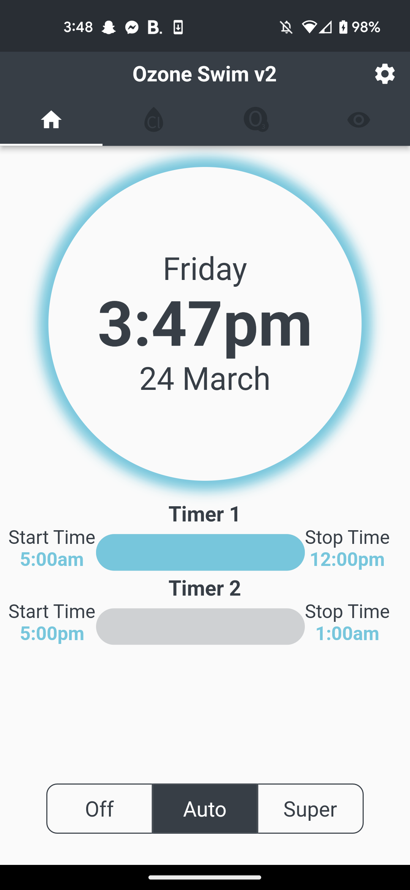
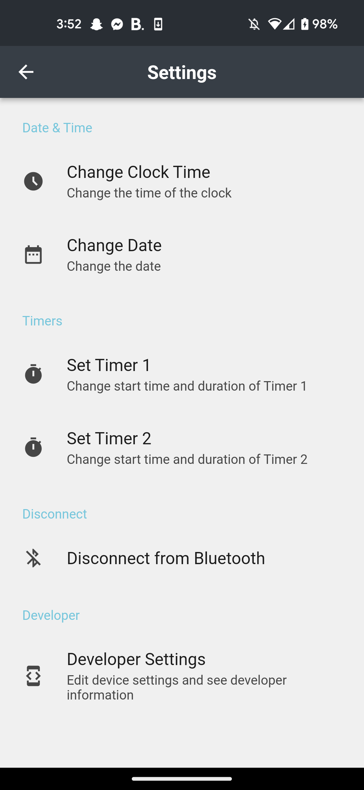

# Ozone Swim v2
Bluetooth Low Energy cross-platform mobile application designed to control Maytronics Ozone Swim v2 devices.

## Installation
Before you install this app, make sure that your phone supports bluetooth low energy (BLE).
Almost all phones made after 2013 support this.

### Android
The most current application APK is in the root directory of this git reprository.
This APK can be download and transferred onto an Android device that is plugged in via USB.

#### iOS
This app currently hasn't been tested on iOS devices.

## Features
- Connect to Maytronics Ozone Swim v2 device via Bluetooth Low Energy
- View and change device time
- View and change timers
- Change device run mode
- View information about the connected modules
- View and send developer information
- Edit developer device configuration
